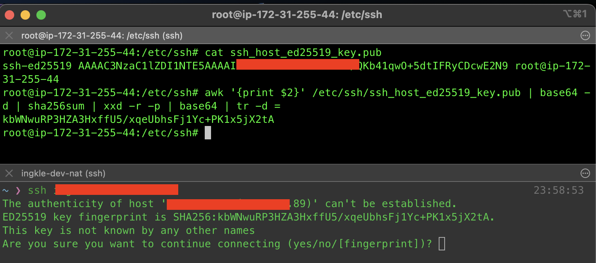
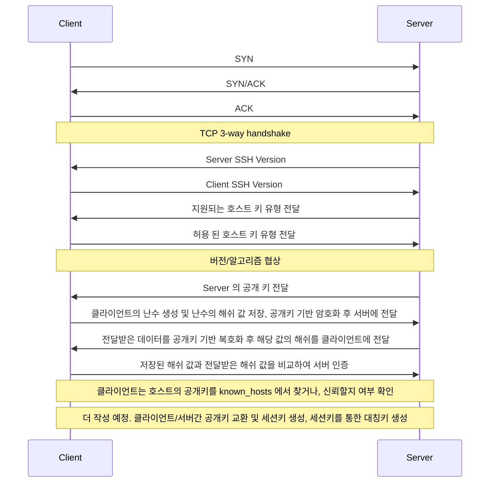

# SSH

SSH 란 Secure Shell 을 의미한다. 기존의 Telnet, Rlogin 등을 대체하기 위해 만들어졌다. 기존의 그러한 툴들은 데이터가 평문(Plain text)로 전송되기 때문에 중간에 데이터를 가로채는 경우 비밀번호와 같은 민감한 데이터를 모두 가로 챌 수 있다는 보안적인 문제가 있다. 

SSH 프로토콜은 보호되지 않은 네트워크(인터넷)상에서 원격 호스트와 안전하게 데이터를 주고받기 위해 만들어졌다.

SSH는 세가지의 계층으로 구성되는데.

- 전송 계층은 인증 과정 및 인증 이후에 클라이언트와 서버 간에 안전하고 암호화된 통신을 설정하게 됩니다. 데이터의 암호화, 복호화 및 무결성체크를 하고 데이터 압축 및 캐싱을 제공해서 데이터 교환 속도를 높이는데 도움이 됩니다.
- 인증 계층은 지원되는 인증 방법을 클라이언트에 전달하고, 전체 인증 프로세스를 수행합니다.
- 연결 계층은 인증이 성공한 이후 시스템 간의 통신을 관리합니다. 또한 암호화된 터널/채널 각각에 대해 다중화가 가능하여 여러 세션이 원격지 호스트의 쉘을 접근하여 사용 가능하게 합니다.

## SSH 의 사용 목적

- 원격 액세스 : SSH는 암호화된 원격 연결을 가능하게 합니다.
- 파일 전송 : SSH에서 관리하는 보안 파일 전송 프로토콜인 SFTP 는 네트워크를 통해 안전하게 파일을 조작 할 수 있는 방법을 제공합니다.
- X11 전달
- 포트포워딩
- 터널링
- 네트워크 관리

## SSH 의 동작

SSH는 클라이언트/서버 기반의 프로토콜입니다. 클라이언트가 SSH를 통해 서버에 연결하면 시스템을 로컬 컴퓨터처럼 조작 할 수 있습니다. 

`ssh [username]@[server_ip_or_hostname]` 와 같은 명령어를 통해 연결을 시작 할 수 있습니다. 

보안 채널을 설정하기 위한 프로세스는 아래와 같습니다.

### 연결 설정

SSH 서버는 특정 포트에서(기본은 22) 클라이언트가 보낸 요청을 수신합니다. 클라이언트가 서버에 연결 요청을 보낸 후 클라이언트와 서버 간에 TCP 연결이 생성됩니다.

### 버전 협상

SSH에는 SSH1.X / SSH2.0 의 두가지 버전이 있는데 SSH2.0 을 표준으로 사용합니다. 

### 알고리즘 협상

SSH는 여러 암호화 알고리즘을 지원합니다. 클라이언트 서버 간 지원하는 알고리즘을 기반으로 세션 키(대칭 키) 생성을 위한 키 교환 알고리즘, 데이터 암호화를 위한 암호화 알고리즘, 인증을 위한 공개 키 알고리즘, 데이터 무결성 보호를 위한 HMAC 알고리즘을 협상합니다.

### 키 교환

서버와 클라이언트는 키 교환 알고리즘을 사용하여 암호화 된 채널을 설ㅈ어하는데 사용될 공유 세션 키(대칭 키)와 세션 ID를 동적으로 생성합니다. 세션 키는 전송을 위한 데이터를 암호화 하는데 사용되며 세션 ID는 인증 시 SSH 연결을 식별하는데 사용됩니다.

### 사용자 인증

클라이언트가 서버에 인증 요청을 보낸 다음 서버가 클라이언트를 인증합니다. 아래와 같은 인증 모드가 지원됩니다.

#### 암호 인증

클라이언트는 암호화된 사용자 이름과 암호를 서버에 보냅니다. 서버는 사용자 이름과 암호를 해독하고 로컬에 저장된 사용자 이름 및 암호와 비교하여 인증 성공 또는 실패 메시지를 반환합니다. 여느 ID/Password 기반의 인증이 그렇듯 브루트포스 공격의 대상이 될 수 있습니다.

#### 공개 키 인증

클라이언트는 공개 키 및 공개 키 알고리즘을 사용하여 인증을 위해 서버와 데이터를 교환합니다. 

#### 비밀번호 + 공개키

클라이언트는 비밀번호 인증과 공개키 인증을 모두 사용하여 인증을 받아야 합니다.

#### 비밀번호/공개키 중 하나

클라이언트에 대해서 암호 인증 혹은 공개키 중 하나의 인증을 사용합니다. (둘 중 하나)

### 세션 요청

인증에 성공 한 후 SSH 클라이언트는 서버에 세션 요청을 보냅니다.

### 세션 상호 작용

세션이 설정되면 SSH 서버와 클라이언트가 데이터를 교환합니다. 

## 클라이언트 <-> 서버간 보안 채널 생성 프로세스 예시

### 서버 확인

클라이언트는 원격 접속을 하고자 하는 서버를 확인해야 합니다. 

이 때 클라이언트가 서버에 처음으로 SSH 요청을 하는 경우 서버의 공개 키를 확인하게 됩니다. 

만약 클라이언트의 `~/.ssh/known_hosts` 에 해당 서버의 공개 키가 없다면, 사용자에게 공개키의 fingerprint를 보여주며 연결 할 것인지 물어봅니다.

만약 `ssh -o StrictHostKeyChecking=no [username]@[server_ip_or_hostname]` 와 같이 호스트 키 체킹 옵션을 사용하지 않았다면,

`Are you sure you want to continue connecting (yes/no/[fingerprint])?` 와 같은 사용자 interactive 한 요청을 ssh 클라이언트가 우리에게 보여주지 않습니다.

여기서 핑거프린트는 서버의 공개키의 Hash 키 이며 조작되기 어려운 값입니다. 이 값은 실제로 서버의 `/etc/ssh/ssh_host_{알고리즘}_key.pub` 을 기반으로 만들어지는 해쉬값입니다. 

실제로 호스트 서버에서 이 값을 확인해보고 싶다면,

```
$ awk '{print $2}' /etc/ssh/ssh_host_{알고리즘}_key.pub | base64 -d | sha256sum | xxd -r -p | base64 | tr -d =
$ ssh-keygen -l -f /etc/ssh/ssh_host_{알고리즘}_key.pub
```

위와 같은 명령어들로 확인 가능합니다. ssh-keygen 이 아닌 명령어 파이프를 보면 알겠지만, 호스트 서버의 공개키를 base64 디코딩하고, 해싱하고, 인코딩하는 그런 과정들을 거칩니다. 


(호스트의 공개키 기반의 해시인 핑거프린트를 확인 하는 방법 및 ssh 클라이언트에서도 동일한 값을 볼 수 있다)

`Are you sure you want to continue connecting (yes/no/[fingerprint])?` 과정에서 `yes`를 입력하면 클라이언트의 `~/.ssh/known_hosts` 에 호스트의 공개키가 등록이 됩니다. 

```
Warning: Permanently added 'hostname' (알고리즘) to the list of known hosts.
```

이후 클라이언트에서 난수 값을 만들고, 이 값에 대한 해시를 저장합니다. 이후 난수 값을 서버의 공개키로 암호화 하여 서버에 전달하고, 서버는 암호화된 데이터를 자신의 공개키로 복호화 한 후 값을 알아냅니다. 복호화 된 값을 통한 해시값을 만들어 클라이언트에 전달하고 자신이 저장한 해시값과 비교하여 정상인 경우 서버 인증이 완료됩니다.

