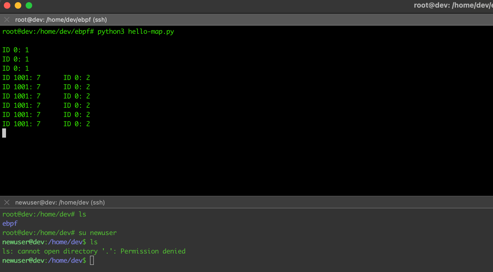

# BPF Map

BPF 맵 

eBPF 맵은 eBPF프로그램 / 유저 스페이스에서 액세스 할 수 있는 데이터 구조. 
맵은 여러 eBPF 프로그램간 데이터를 공유하거나, 유저 스페이스 애플리케이션과 커널에서 실행중인 eBPF 프로그램간의 통신 하는데도 사용 가능한데, 일반적인 용도는 아래와 같다.

- 유저 스페이스에서 작성한 구성 정보를 eBPF 프로그램에서 검색 할 수 있다.
- 나중에 다른 eBPF 프로그램(혹은 동일한 프로그램을 나중에 실행 할 때) 검색 할 수 있도록 상태를 저장한다.
- eBPF 프로그램에서 만든 결과나 메트릭을 map 에 저장하고, 유저스페이스 앱이 그 결과를 사용 할 수 있다.

다양한 형태의 BPF맵은 Linux 의 uapi/linux/bpf.h 파일에 정의되어있다.

내가 테스트중인 Ubuntu 22.04 LTS 환경에서는 커널 버전이 `5.15.0-91` 이라서

```text
root@dev:/usr/src/linux-headers-5.15.0-91/include/uapi/linux# uname -a
Linux dev 5.15.0-91-generic #101-Ubuntu SMP Tue Nov 14 13:29:11 UTC 2023 aarch64 aarch64 aarch64 GNU/Linux

/usr/src/linux-headers-5.15.0-91/include/uapi/linux/bpf.h 에 정의되어있음. 
```

`$ locate {header_name}` 형태로 위치 조회 가능하니 참고!

```c
enum bpf_map_type {
	BPF_MAP_TYPE_UNSPEC,
	BPF_MAP_TYPE_HASH,
	BPF_MAP_TYPE_ARRAY,
	BPF_MAP_TYPE_PROG_ARRAY,
	BPF_MAP_TYPE_PERF_EVENT_ARRAY,
	BPF_MAP_TYPE_PERCPU_HASH,
	BPF_MAP_TYPE_PERCPU_ARRAY,
	BPF_MAP_TYPE_STACK_TRACE,
	BPF_MAP_TYPE_CGROUP_ARRAY,
	BPF_MAP_TYPE_LRU_HASH,
	BPF_MAP_TYPE_LRU_PERCPU_HASH,
	BPF_MAP_TYPE_LPM_TRIE,
	BPF_MAP_TYPE_ARRAY_OF_MAPS,
	BPF_MAP_TYPE_HASH_OF_MAPS,
	BPF_MAP_TYPE_DEVMAP,
	BPF_MAP_TYPE_SOCKMAP,
	BPF_MAP_TYPE_CPUMAP,
	BPF_MAP_TYPE_XSKMAP,
	BPF_MAP_TYPE_SOCKHASH,
	BPF_MAP_TYPE_CGROUP_STORAGE,
	BPF_MAP_TYPE_REUSEPORT_SOCKARRAY,
	BPF_MAP_TYPE_PERCPU_CGROUP_STORAGE,
	BPF_MAP_TYPE_QUEUE,
	BPF_MAP_TYPE_STACK,
	BPF_MAP_TYPE_SK_STORAGE,
	BPF_MAP_TYPE_DEVMAP_HASH,
	BPF_MAP_TYPE_STRUCT_OPS,
	BPF_MAP_TYPE_RINGBUF,
	BPF_MAP_TYPE_INODE_STORAGE,
	BPF_MAP_TYPE_TASK_STORAGE,
};
```

일반적으로 이런 맵들은 모두 Key-Value 저장소다.
일부 맵은 항상 4바이트 인덱스가 키로 사용되는 배열로 정의되고, 다른 맵은 임의의 데이터 유형을 키로 사용할 수 있는 해시 테이블이다.
(해시테이블은 파이썬에서 딕셔너리와 비슷한것이라고 보면 된다.)

이 BPF 맵들에는 특정 동작에서의 성능을 최적화하기위한 유형들이 있는데, FIFO 큐, FILO 스택, LRU 데이터 저장소, 
longest-prefix matcing, 블룸필터 등도 있다.

sockmaps, devmaps 의 경우 소켓과 네트워크 장치에 대한 정보를 들고있고, 이것들은 네트워크 관련 eBPF 프로그램에서
트래픽을 리다이렉션 하는데 사용된다.

또한 `BPF_MAP_TYPE_PROG_ARRAY`는 인덱싱된 eBPF 프로그램의 집합을 저장하고, 이것은 한 프로그램이 다른 프로그램을 호출 할 수 있는
tail call 을 구현하는데 사용된다. 또한 `BPF_MAP_TYPE_HASH_OF_MAPS`, `BPF_MAP_TYPE_ARRAY_OF_MAPS` 와 같이 맵에 대한 정보 저장을 지원하는 유형도 있다.

또한 일부 유형에는 `BPF_MAP_TYPE_PERCPU_HASH` 와 같이 `per CPU` 라는 이름을 들고 있는데. 각 CPU 코어 버전별로
다른 메모리 블록을 사용한다는 의미입니다. 여러 CPU 코어가 동일한 맵에 동시에 액세스 할 수 있는 `per CPU`가 아닌 맵 유형에서는 동시성 문제가 발생 할 수 있다.

## Hash Table 맵 예제

```c
BPF_HASH(counter_table);

int hello(void *ctx) {
  u64 uid;                                                  
  u64 counter = 0;
  u64 *p;

  uid = bpf_get_current_uid_gid() & 0xFFFFFFFF;
  p = counter_table.lookup(&uid);
  if (p != 0) {
     counter = *p;
  }
  counter++;
  counter_table.update(&uid, &counter);
  return 0;
}
```

`BPF_HASH()`는 BCC 매크로이며, 해시 테이블 맵을 정의한다. 

`bpf_get_current_uid_gid()`는 BPF 헬퍼 함수로 이 `kprboe` 이벤트를 트리거한 프로세스를 실행시킨 유저의 ID를 받아온다. 

user ID 는 64bit 값중에서 아래 32bit 값만을 리턴한다. 나머지 위 32bit 값은 gid 인데, 마스킹되어있다.

`p = counter_table.lookup(&uid);` 의 경우 해시 테이블에 현재 `uid` 키가 있는지 확인하는 부분이다. 
헤시테이블에서 uid 키와 매칭되는 값의 포인터를 반환한다. 

여기서 

`p = counter_table.lookup(&uid);`
`counter_table.update(&uid, &counter);`

위 두 부분은 C 코드가 아니라고 생각 할 수 있다. C언어는 메소드를 지원하지 않기 때문에! 
느슨하게 C와 비슷한 BCC 의 버전을 보여주는 예제로, BCC는 코드 컴파일러로 보내기 전에 `C` 코드에 맞도록 알아서 변환한다.
BCC는 편리한 매크로와 shorcuts 를 제공하고, BCC는 그걸 적절한 C 코드로 변환한다. 

```python3
b = BPF(text=program)
syscall = b.get_syscall_fnname("execve")
b.attach_kprobe(event=syscall, fn_name="hello")

while True:
    sleep(2)
    s = ""
    for k, v in b["counter_table"].items():
        s += f"ID {k.value}: {v.value}\t"
    print(s)
```

위 코드는 유저 스페이스 애플리케이션 영역이고. BPF 프로그램을 명시하고, 어떤 시스템 콜이 호출 될 때 이 eBPF 프로그램을
트리거 할지 지정한다. 

```python3
while True:
    sleep(2)
    s = ""
    for k, v in b["counter_table"].items():
        s += f"ID {k.value}: {v.value}\t"
    print(s)
```

위 부분이 진짜 유저 스페이스에서 파이썬 코드로 구현하는 부분인데. `counter_table` 이라는 해시맵에서 key / value 를 꺼내오고 
모든 key / value 에 대해서 `ID KEY: VALUE ` 형태로 이어붙여서 출력하도록 하는 부분이다.



이 예제에서는 해시 테이블을 사용해서 `eBPF` 프로그램에서 유저 스페이스로 데이터를 전달할 수 있었다. 
`userId` 키가 정수이므로 배열 유형의 맵을 사용 할 수 있었지만, 해시 테이블은 어떤 유형의 키도 사용 가능하기때문에 테스트 해보았다. 

다만 해시 테이블은 데이터 자체가 키-값 쌍으로 구성된 경우 편리하긴 하지만, 유저 스페이스 코드에서 계속 테이블을 폴링해야 한다는 단점이 있다.
eBPF 에는 perf 버퍼와 BPF 링 버퍼를 통해서 커널에서 사용자 공간으로 지속해서 데이터를 보낼 수 있는 perf 서브시스템이 지원된다.

## perf 버퍼, BPF ring buffer 추가 작성 예정 
