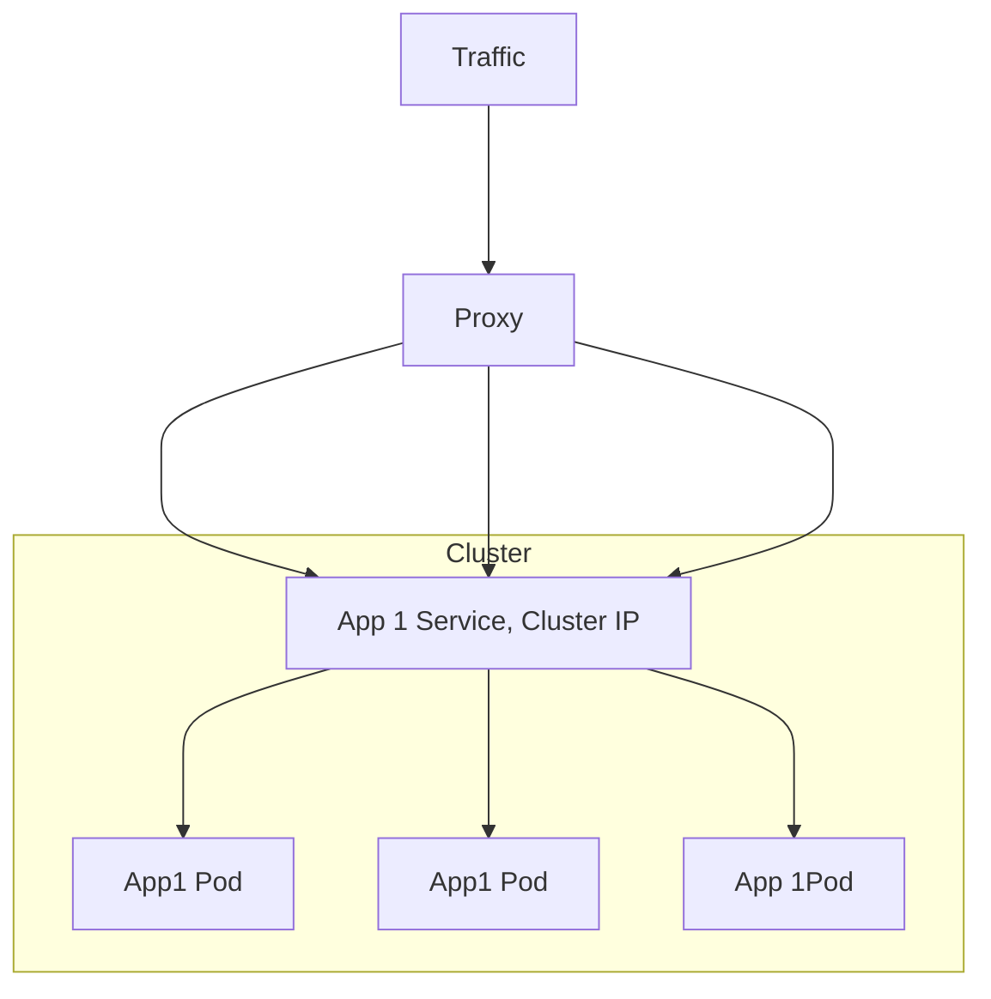
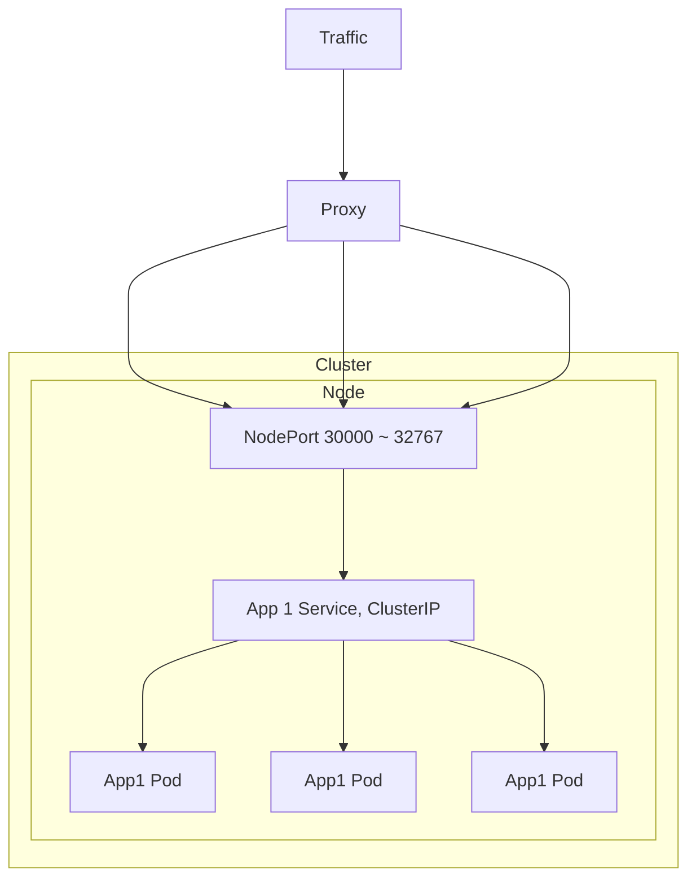
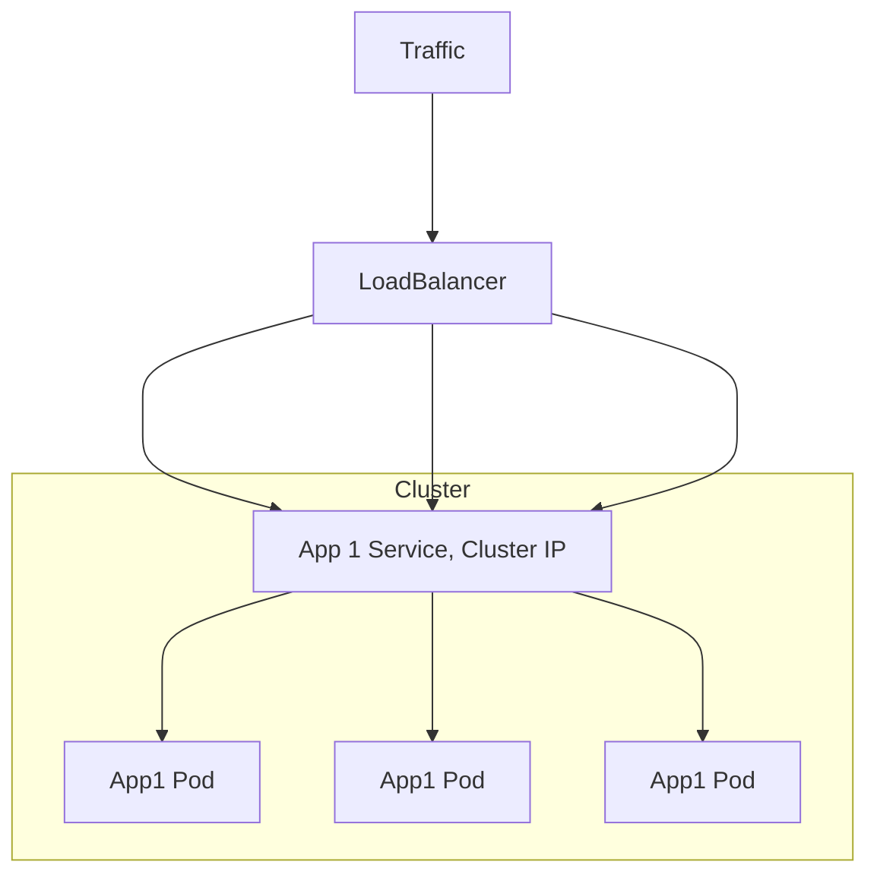
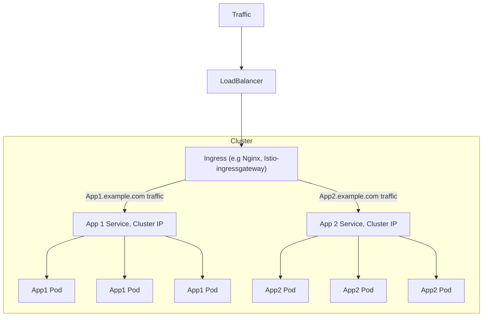
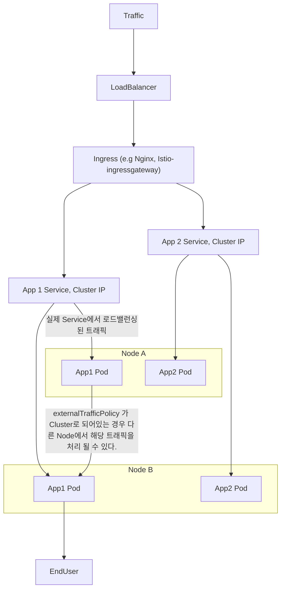

# Services

파드는 매우 dynamic하다. (제거, 추가 등)

레플리케이션 컨트롤러를 사용하는경우 파드는 스케일링 하는 과정에서 제거 ,삭제 됨

배포를 사용하는 경우 이미지 버전 업데이트등을 하는 경우 기존 파드는 제거되고 새로운 파드로 대체 됨

이렇기 때문에 파드를 직접 접근하는것이 아닌 서비스를 통해서 접근하는것이 추천됨 

서비스는 언젠가 제거될 파드와 다른 서비스, 혹은 엔드유저간의 논리적인 다리임. 

정리하자면 파드 집합에서 실행중인 애플리케이션을 네트워크 서비스로 노출하는 추상화 된 방법이다. 이렇게 함으로써 사용자나 다른 서비스는 파드의 다이나믹하게 변경되는 IP 어드레스를 통해 접근하는게 아니라 추상화되고 고정된 네트워크 주소를 통해 실제 파드와 연결이 가능하다. 

## Services 종류

1. ClusterIP

ClusterIP는 클러스터 내에서만 연결 할 수 있는 가상의 IP임



Cluster IP 서비스는 서비스를 통해 들어온 트래픽을 해당하는 Pod 들에 로드밸런싱합니다. 클러스터 내부에서만 유효하며 외부와의 통신은 불가능합니다.

2. NodePort



NodePort는 워커노드의 30000 ~ 32767 포트에 대해서 설정 가능하며. 지정한 포트에 대해서 워커노드IP:Port 로 접근하는 경우 해당 트래픽을 ClusterIP 로 넘겨주는 동작을 한다. 워커노드의 포트를 통해서 서비스에 접근하므로 외부에서 접근 가능하다.

```yaml
apiVersion: v1
kind: Service
metadata:  
  name: <string>
spec:
  selector:    
    app: <string>
  type: NodePort
  ports:  
  - name: http
    port: 80
    targetPort: 80
    nodePort: 30001
    protocol: TCP
```

위에서 port, targetPort, nodePort 세가지 포트가 명세에 존재하는데. 

nodePort는 워커노드에 접근 할 포트번호로 30000 ~ 32767 사이를 지정해야 한다.

port는 Cluster 내부에서 사용할 Service객체의 포트이다. ClusterIP의 포트라고 보면 된다. 

targetPort는 Service객체로 전달된 요청을 실제 Pod 로 전달 할 때 사용하는 포트이다. 

### 왜 30000 ~ 32767 이 기본 범위일까?

22 등 well-known 포트는 이미 노드 머신에서 사용 중일 가능성이 높으며, 80, 443 등도 마찬가지. 그래서 최대한 기본적으로 사용하거나 자주 사용하는 포트 범위와 벗어난 범위가 k8s 기본 nodePort 할당 범위로 지정됨.

이 NodePort 범위는 kube-apiserver 가 제어한다.

On-premise 에 k8s를 설치해 사용중이거나, 클라우드 공급자의 컨트롤 플레인에 접근이 가능하다면(되는진 모르겠네요) 이 값을 kube-apiserver 스펙을 아래와 같이 변경 할 수 있다.

```yaml
# /etc/kubernetes/manifests/kube-apiserver.yaml

...
spec:
  containers:
  - command:
    - kube-apiserver
    - --authorization-mode=Node,RBAC
    ...
    - --service-node-port-range=30000-50000
...
```

ref : https://blog.frec.kr/cloud/modify_nodeport_range/

ref : https://kubernetes.io/ko/docs/concepts/services-networking/service/#type-nodeport


## LoadBalancer

Loadbalancer 타입의 서비스는 서비스를 생성함과 동시에 로드밸런서를 새롭게 생성하여 서비스와 연결합니다. 로드밸런서를 생성하는 기능을 제공하는 환경, 즉 클라우드 공급자가 제공하는 환경에서 사용 가능하며, 온프레미스 환경 같은 경우는 MetalLB 등으로 사용 가능하다고 함



서비스에는 ClusterIP가 역시나 할당된다. 

```yaml
apiVersion: v1
kind: Service
metadata:
  name: httpbin-test
  labels:
    app: httpbin-test
    service: httpbin-test
spec:
  ports:
    - name: http
      port: 8000
      targetPort: 80
    - name: http2
      port: 8001
      targetPort: 81
    - name: http3
      port: 8002
      targetPort: 82
    - name: http4
      port: 31602
      targetPort: 82
  selector:
    app: httpbin-test
  type: LoadBalancer
```

예를들어 위와 같이 셋업하여 LB를 생성하면 클라우드공급자가 NodePort 범위에서 랜덤하게 각 port(서비스 포트)에 대한 포트를 개방하는데. 이 포트를 통해서 파드에 접근 할 수 있습니다. 일종의 NodePort라고 할 수 있고. EKS의 경우에는 생성 하는 경우 자동으로 보안그룹까지 생성되어 해당 노드,포트로 트래픽이 들어 갈 수 있도록 inbound를 열게 됩니다.

### 로드밸런서를 몇개나 생성해야 할까

만약 클라우드 공급자의 K8s 서비스를 사용하는 와중에 여러 서비스를 외부에 노출 해야 할 때. 각 서비스별로 로드밸런서를 생성하는것은 매우 비효율적일것이다. 

이 때 필요한것이 바로  Ingress, IngressClass이다.

Ingress는 여러 서비스드를 하나로 묶는 일종의 라우터 역할을 하는데. nginx, istio-ingressgateway 등을 사용한다. 

LB로 부터 들어오는 traffic을 Ingress 가 먼저 수신하고. 내부적으로 정의된 URI, port 등의 정보를 기반으로 Service객체에 트래픽을 전달하는 역할을 한다.

이렇게 함으로서 소수의 LB로부터(혹은 1개) 여러 서비스에 대해서 클러스터 외부에 서비스를 노출시킬 수 있다.




## externalTrafficPolicy

LB와 NodePort 모두에 해당하는 내용.

외부 트래픽 정책이란 외부 트래픽에 대한 응답으로 Service가 노드 안에서만 응답할지, Cluster 전체에서 응답할지 결정하는 옵션임.

Local타입은 요청한 클라이언트 IP를 유지도 해주고 네트워크 홉을 길어지지 않게 막아주지만 트래픽 불균형을 가져올 수 있음.

Cluster 타입은 클라이언트 IP를 보존하지 않고 네트워크 홉을 길게 만들지만 전체적으로 부하가 분산되도록 함.

ref : https://sunrise-min.tistory.com/entry/Kubernetes-NodePort-vs-LoadBalancer-vs-Ingress

### Cluster 타입



Cluster 타입으로 지정하면, Node A 의 App1 Pod로 들어온 트래픽이라도, Node B의 App1 Pod가 처리하도록 노드간 트래픽을 전환 하도록 설정되는 것. 이 과정에서 불필요한 네트워크 홉이 한 단계 더 생기게 되며, SNAT이 발생하여 Client IP가 보존되지 않는 단점이 있음

### Local 타입

Local타입으로 설정하면 kube-proxy는 전달 받을 Pod가 있는 노드에만 NodePort를 오픈합니다. Pod가 있는 노드에만 포트를 열고 그 외에는 전달하지 않기 때문에 client IP가 보존되고, 네트워크 홉이 추가로 발생하지 않습니다. 

Local 옵션이 좋아보이지만 아래와 같은 경우에서는 고려해보아야 합니다.

각 node에 Pod가 고르지 않게 스케쥴링 된 경우. 요청이 고르게 분산되지 않을 수 있습니다. 

A노드에는 2개의 파드가, B노드에는 1개의 파드가 생성되어있을 경우. (여기서 파드는 서비스객체의 Endpoint) 각 노드별로 50%씩의 트래픽이 전달되는경우 A노드의 각 파드는 25% 씩의 부하를 감당하지만, B노드의 경우는 50%의 부하를 그대로 받아야 합니다. 

Cluster 타입으로 설정하였을경우 약 33%씩 분담하여 처리되었을 상황입니다.

